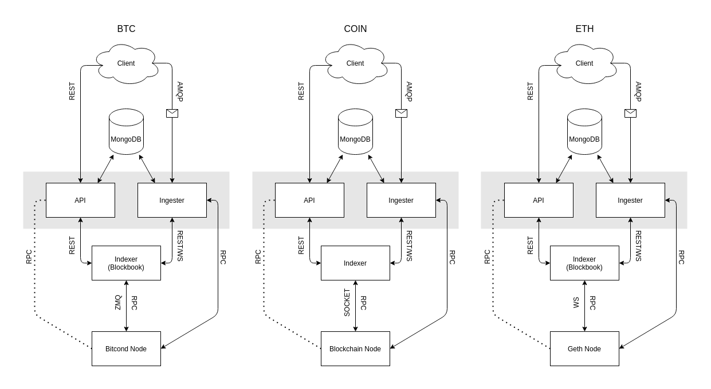

# Introduction

[![ShapeShift](https://img.shields.io/badge/ShapeShift%20DAO-Unchained-386ff9?logo=data:image/svg+xml;base64,PD94bWwgdmVyc2lvbj0iMS4wIiBlbmNvZGluZz0iVVRGLTgiPz4KPHN2ZyB3aWR0aD0iNTdweCIgaGVpZ2h0PSI2MnB4IiB2aWV3Qm94PSIwIDAgNTcgNjIiIHZlcnNpb249IjEuMSIgeG1sbnM9Imh0dHA6Ly93d3cudzMub3JnLzIwMDAvc3ZnIiB4bWxuczp4bGluaz0iaHR0cDovL3d3dy53My5vcmcvMTk5OS94bGluayI+CiAgICA8IS0tIEdlbmVyYXRvcjogU2tldGNoIDU1LjEgKDc4MTM2KSAtIGh0dHBzOi8vc2tldGNoYXBwLmNvbSAtLT4KICAgIDx0aXRsZT5NYXJrPC90aXRsZT4KICAgIDxkZXNjPkNyZWF0ZWQgd2l0aCBTa2V0Y2guPC9kZXNjPgogICAgPGcgaWQ9Ik1vY2stVXBzIiBzdHJva2U9Im5vbmUiIHN0cm9rZS13aWR0aD0iMSIgZmlsbD0ibm9uZSIgZmlsbC1ydWxlPSJldmVub2RkIj4KICAgICAgICA8ZyBpZD0iTGFuZGluZy1QYWdlIiB0cmFuc2Zvcm09InRyYW5zbGF0ZSgtNzY5LjAwMDAwMCwgLTc2LjAwMDAwMCkiIGZpbGw9IiNGRkZGRkUiPgogICAgICAgICAgICA8ZyBpZD0iTmF2IiB0cmFuc2Zvcm09InRyYW5zbGF0ZSg3OS4wMDAwMDAsIDY5LjAwMDAwMCkiPgogICAgICAgICAgICAgICAgPGcgaWQ9IlNTX2hvcml6b250YWxfV2hpdGUiIHRyYW5zZm9ybT0idHJhbnNsYXRlKDY5MC4wNTY4MDAsIDcuNTgxNDUxKSI+CiAgICAgICAgICAgICAgICAgICAgPGcgaWQ9Ik1hcmsiIHRyYW5zZm9ybT0idHJhbnNsYXRlKDAuNDM0Mzk1LCAwLjM1NjgwOCkiPgogICAgICAgICAgICAgICAgICAgICAgICA8cGF0aCBkPSJNNTEuNjY5Njg1Myw1LjEwMzg0NDE5IEw0OC45Njk3MzM5LDIxLjI5OTQ3NzkgTDM5LjM3MDY4MjcsOS45OTYyMTIxMiBMNTEuNjY5Njg1Myw1LjEwMzg0NDE5IFogTTQ5LjAyNzkzMjYsMjguMjY1MTUxNSBMNTEuNDMwODM4MSwzNy4xNDE1NjQzIEwzMy4wNTcyOTQxLDQyLjIwNDQxNzUgTDQ5LjAyNzkzMjYsMjguMjY1MTUxNSBaIE05LjAzMTAzMjQzLDIzLjgwNDEyMDYgTDE4Ljg4MTk2NzMsMTAuOTI3ODI1NiBMMzUuOTg5MTA4OSwxMC45Mjc4MjU2IEw0Ni45MjM0Njk3LDIzLjgwNDEyMDYgTDkuMDMxMDMyNDMsMjMuODA0MTIwNiBaIE00NS42NTcwNjcyLDI2Ljk4NTU4MDUgTDI3Ljg0NTAyMzcsNDIuNTMwOTQ4IEw5LjcwMjg3NzU1LDI2Ljk4NTU4MDUgTDQ1LjY1NzA2NzIsMjYuOTg1NTgwNSBaIE0xNS41ODMyNjgzLDEwLjAwNTUyODMgTDYuNzgwODQwMTUsMjEuNTEwOTU0MSBMNC4wNzc2Mjk2Myw1LjE2NjI2MjI5IEwxNS41ODMyNjgzLDEwLjAwNTUyODMgWiBNMjIuNTY5NDMzMyw0Mi4xOTkyOTM2IEw0LjAyMDgyNzc2LDM3LjE0NTc1NjYgTDYuNTYyNDc4ODQsMjguNDg0MDgwNyBMMjIuNTY5NDMzMyw0Mi4xOTkyOTM2IFogTTI1Ljk5NDMwNjksNDYuNDI5NzUwMiBMMjIuNDkyNjExMSw1MC4yODQzMDA4IEMxOS41MjU0MTE1LDQ3LjQ2NDc3MjcgMTYuMjYzMDI4NCw0NC45NjEwNjE2IDEyLjc4MDQyMTcsNDIuODI5NTMwMSBMMjUuOTk0MzA2OSw0Ni40Mjk3NTAyIFogTTQyLjk3ODA2NzQsNDIuNzcwODM4NSBDMzkuNDk1NDYwNiw0NC45MzY4Mzk3IDM2LjI0MDk5MjYsNDcuNDczMTU3MiAzMy4yOTI0MTY2LDUwLjMxOTcwMjEgTDI5LjcxNjY5MjEsNDYuNDI0NjI2MyBMNDIuOTc4MDY3NCw0Mi43NzA4Mzg1IFogTTU1LjczNDI3ODQsMC4wNjI4ODM5MDY2IEwzNi40MTk3Nzg4LDcuNzQ2MzY1NjggTDE4LjQxNzc3NSw3Ljc0NjM2NTY4IEw5Ljk0NzU5ODNlLTE0LC04LjE3MTI0MTQ2ZS0xNCBMNC4xODM3ODM5NiwyNS4yOTU2MzM3IEwwLjE2NjIxNTMyMSwzOC45ODgwMjIxIEwxMC42NDgwMjM1LDQ1LjI1NzMxNDcgQzE1LjYxMDczODEsNDguMjI1OTAwOSAyMC4wNTYxODMxLDUxLjk0MDI0MzcgMjMuODYwNTExOSw1Ni4yOTY0NjgxIEwyNy45NDE4NjYzLDYwLjk2OTkwNjggTDMyLjIyNTI4NjMsNTYuMDU1MTgwMiBDMzUuOTAwNjQ2OSw1MS44Mzc3NjYyIDQwLjE4MDgwNzgsNDguMjE3NTE2NCA0NC45NDY1NzgyLDQ1LjI5NDU3OTIgTDU1LjIyNTg1NTEsMzguOTg4MDIyMSBMNTEuNTIzOTU1OSwyNS4zMTQyNjYgTDU1LjczNDI3ODQsMC4wNjI4ODM5MDY2IEw1NS43MzQyNzg0LDAuMDYyODgzOTA2NiBaIiBpZD0iRmlsbC0xNiI+PC9wYXRoPgogICAgICAgICAgICAgICAgICAgIDwvZz4KICAgICAgICAgICAgICAgIDwvZz4KICAgICAgICAgICAgPC9nPgogICAgICAgIDwvZz4KICAgIDwvZz4KPC9zdmc+)](https://github.com/shapeshift/unchained) [](https://github.com/shapeshift/unchained/blob/main/LICENSE) [](https://github.com/shapeshift/unchained/pulls) [](https://circleci.com/gh/shapeshift/unchained/tree/develop)

Unchained is a multi-blockchain backend interface with three main goals:
1. Provide a common interface to multiple blockchains
2. Provide additional information not always accessible from the node directly
3. Provide realtime updates about blockchain transactions (pending and confirmed)

## Table Of Contents

- [Helpful Docs](#helpful-docs)
- [Project Structure](#project-structure)
- [Coin Stack Components](#coin-stack-components)
- [Dependencies](#dependencies)
- [Notes](#notes)
- [Initial Setup](#initial-setup)
- [Ports](#ports)
- [Docker-Compose Local Dev Instructions](#docker-compose-local-dev-instructions)
  - [Prerequisites](#prerequisites)
  - [Running](#running)
- [Kubernetes Local Dev Instructions](#kubernetes-local-dev-instructions)
  - [Docker Desktop (macOS)](docs/docker-desktop.md)
  - [Minikube (Linux)](docs/minikube.md)

## Helpful Docs

- [Pulumi](https://www.pulumi.com/docs/)
- [Kubernetes](https://kubernetes.io/docs/home/)
- [OpenAPI](https://github.com/OAI/OpenAPI-Specification)
- [TSOA](https://tsoa-community.github.io/docs/)

## Project Structure

- `packages` - shared internal packages across coinstacks
- `coinstacks/common` - common coinstack logic to reduce duplication
- `coinstacks/{coin}` - coin specific logic
- `**/pulumi` - pulumi infrastructure logic for deployment

## Coin Stack Components

- **Blockchain Full Node** - coin specific daemon providing historical blockchain data (ie. bitcoind, geth, etc)
- **Indexer** - indexes transaction and balance history by address (if not provided by the node directly)
- **[Ingester](docs/ingester.md)** - ingests blockchain data providing:
  - websocket notification of any newly confirmed or pending transactions
  - stream of historical transaction history
  - additional parsing logic not provided by the indexer or node
- **Common API** - a [REST API](https://api.ethereum.shapeshift.com/docs/) that provides necessary data to a client in a common format across all blockchains



## Dependencies

- [Node.js](https://nodejs.org/en/)
  - [NVM](https://github.com/nvm-sh/nvm#installing-and-updating) \(recommended to install Node.js and npm\)
- [Yarn](https://classic.yarnpkg.com/en/docs/install)
- [Docker](https://docs.docker.com/get-docker/)

## Notes

- The ethereum coinstack is used in all examples. If you wish to run a different coinstack, just replace `ethereum` with the coinstack name you wish to run
- All paths are relative to the root unchained directory (ex. `unchained/{path}`)
- All `pulumi` commands should be run in a `pulumi/` directory (ex. `pulumi/`, `coinstacks/ethereum/pulumi/`)

## Initial Setup

- Install [Node.js LTS](https://nodejs.org/en/)
  - (Optional) use nvm to automatically install the node version specified in `.nvmrc`
    ```sh
    nvm use
    ```
- Install [Yarn](https://classic.yarnpkg.com/en/docs/install)
  ```sh
  npm install --global yarn
  ```
- Install dependencies and build:
  ```sh
  yarn && yarn build
  ```

## Ports

- API: `31300`
- MongoDB: `27017`
- RabbitMQ: `30672`
- RabbitMQ Admin: `31672`

## Docker-Compose Local Dev Instructions

#### _Lightweight local development environment_

#### **Prerequisites**

- Install [docker-compose](https://docs.docker.com/compose/install/)
- Copy sample env file:
  ```sh
  cp coinstacks/ethereum/sample.env coinstacks/ethereum/.env
  ```
- Fill out any missing environment variables

#### **Running**

- To spin up a coinstack:
  - API only (watcher service is for hot reloading):
    ```sh
    COINSTACK=ethereum docker-compose up api watcher
    ```
  - API + Ingester (more resource intensive):
    ```sh
    COINSTACK=ethereum docker-compose up
    ```
- To completely tear down the coinstack (including docker volumes):
  ```sh
  COINSTACK=ethereum docker-compose down -v
  ```

Toubleshooting:
    the api claims to be running on listening at http://localhost:3000; however in docker compose its actually running on http://localhost:31300

## Kubernetes Local Dev Instructions

#### _Mirrors production kubernetes environment as closely as possible_

---
### [Docker Desktop (macOS)](docs/docker-desktop.md)
### [Minikube (Linux)](docs/minikube.md)
