# Unchained coinstack backup & restore

Automated backup can be configured via nodestack config. Alternatively, manual snapshots can be taken either with the use of `VolumeSnapshot` k8s crd's, or via the EC2 Volume Snapshot mechanism.

## Manual Snapshot
1. Manually scale the statefulset of the target coinstack down in k9s
	- Select desired namespace with: `:ns` and highlighting the namespace and pressing enter  
	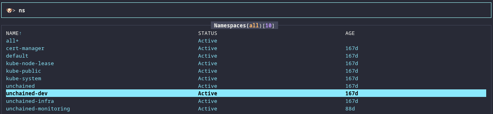
	_if coinstacks are healthy in `unchained-dev` it is easiest to do it there to avoid any interruptions in production_  
	- Select desired statefulset with: `:sts` and highlighting the statefulset (ex. `ethereum-sts`)  
	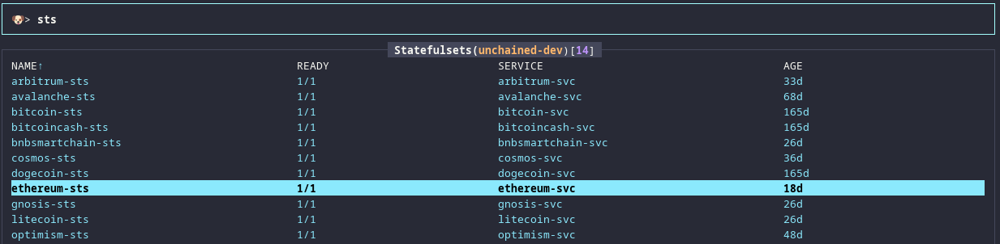
	- Scale statefulset with: `s` (set replica count to one less than current count and select `OK`)  
	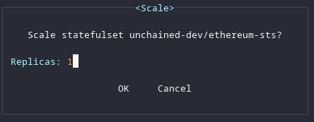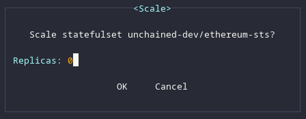
	- This will trigger the statefulset to scale down which will make the ebs volume available for snapshot
1. Take a snapshot of the target coinstack's EBS volumes in the AWS console
	- Navigate to `EC2` -> `Elastic Block Store` -> `Volumes`  
	
	- Search by coinstack name (ex. `ethereum`) and wait for the `Volume state` to show `Available`  
	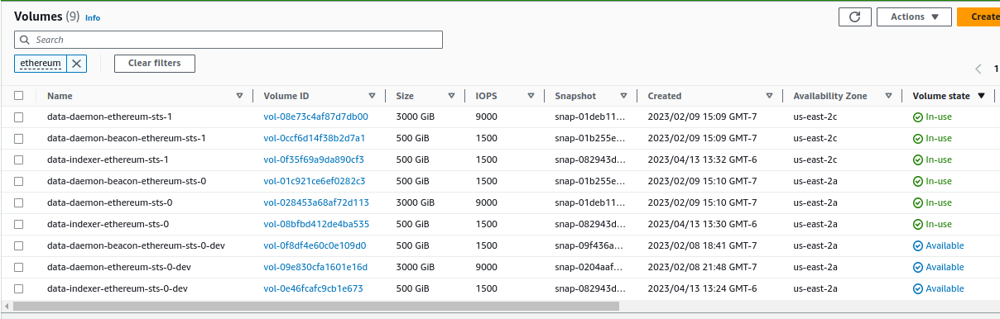
	- EBS volumes created by kubernetes do not show a `Name`, but you can view the `Tags` to see what volume you are looking at (namespace and pvc name)  
	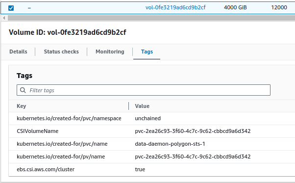
	- Right click and select `Create snapshot`  
	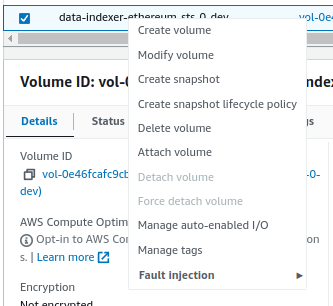
	- Enter the description in the form of `{coinstack}-{service}` and select `Create snapshot` (ex. `ethereum-indexer`, `ethereum-daemon`, `ethereum-daemon-beacon`)  
	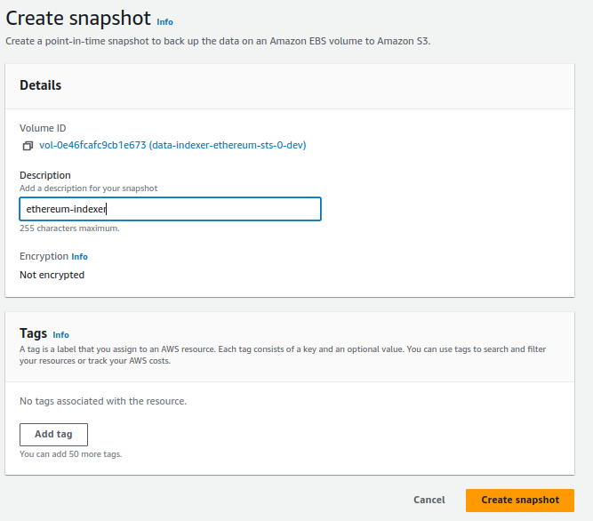
	- Repeat for each volume in the coinstack
1. Manually scale the statefulset of the target coinstack back up in k9s  
	
1. Wait for snapshot to complete 
	- Navigate to `EC2` -> `Elastic Block Store` -> `Snapshots`  
	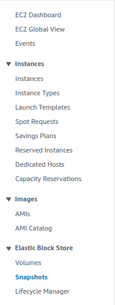
	- `Snapshot status` will go from `Pending` -> `Complete`  
	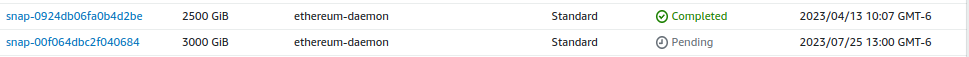

## Manual Restore
1. Manually scale the statefulset of the target coinstack down in k9s (see above)
1. Delete the pvc associated with the statefulset replica to be restored
	- Select desired namespace with: `:ns` and highlighting the namespace and pressing enter  
	- Select desired pvc with `:pvc` and highlighting the pvc (ex. `data-daemon-ethereum-sts-0`)  
	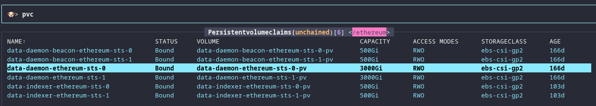
	- Take note of the `VOLUME` name to know which pv to delete associated with this pvc (ex. `data-daemon-ethereum-sts-0-pv`)
	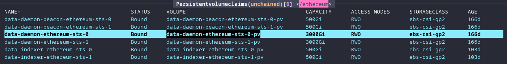
	- Delete the pvc with `ctrl+d` and select `OK`  
	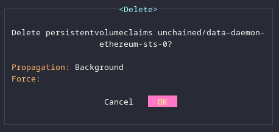
1. Delete the pv associated with pvc deleted above
	- Select desired pv with `:pv` and highlighting the pv (ex. `data-daemon-ethereum-sts-0-pv`)  
	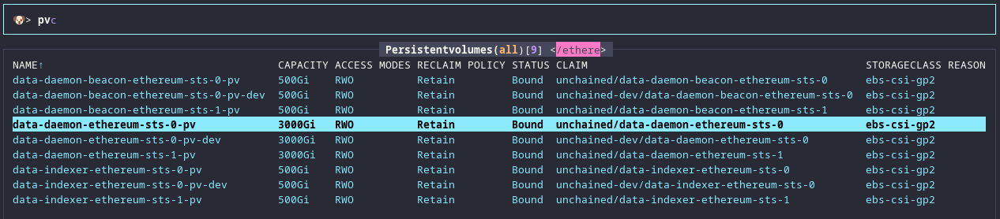
		- `RECLAIM POLICY` indicates whether the pv and associated ebs volume will be `Retain` or `Delete` upon deletion of the pvc
		- `STATUS` indicates whether the pv is `Bound` (pvc exists) or is `Released` (pvc has been deleted)
	- Take note of the `CLAIM` name as another way to see what pvc is associated (format is `{namespace}/{pvc_name}`)
	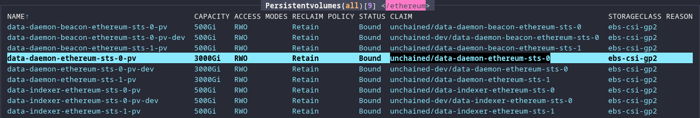
	- Take note of what availability zone the pv is in before deleting (needed for creating the new volume in the correct AZ)
		- Describe the pv with: `d`  
		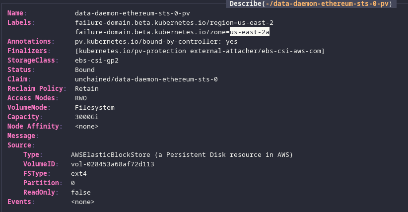
	- Delete the pv with `ctrl+d` and select `OK`  
	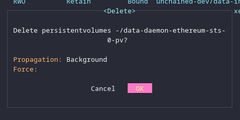
1. Create new EBS volume from snapshot
	- Navigate to `EC2` -> `Elastic Block Store` -> `Snapshots`
	- Right click and select `Create volume from snapshot`  
	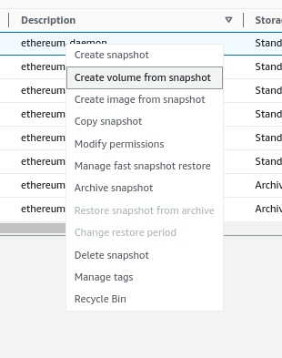
	- Use the pre-filled `Volume type` and `Size`
	- Select the correct `Availability Zone`  
	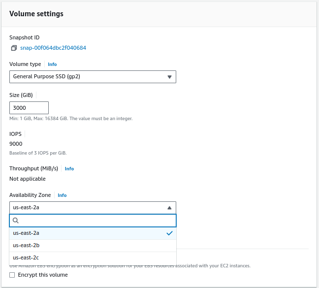
	- Add a `Name` tag for the specific volume being created in the form of `data-{service}-{coinstack}-sts-{replicaNumber}` and add `-dev` suffix if it is a coinstack in the `unchained-dev` namespace  
	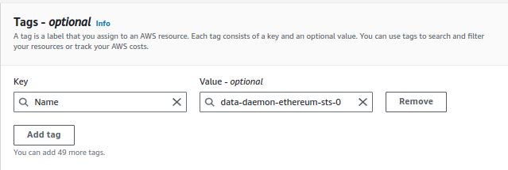
1. Update the [retore-pvc.yaml](./restore-pvc.yaml)
	- Replace all `<items>` with the appropriate data
	- `PersistentVolume.metadata.name` is suffixed with `-pv` (or `-pv-dev` for `unchained-dev` namespace)
	- `PersistentVolume.spec.capacity.storage` must match the size of the EBS volume
	- `PersistentVolume.spec.csi.volumeHandle` is the `Volume ID` of the EBS volume  
	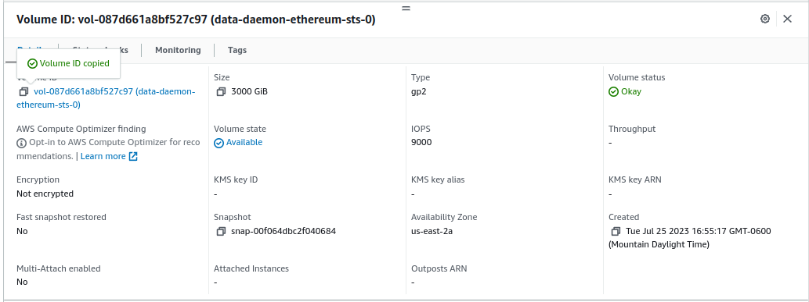
	- `PersistentVolume.spec.nodeAffinity...` region must match the `Availability Zone` of the EBS volume  
	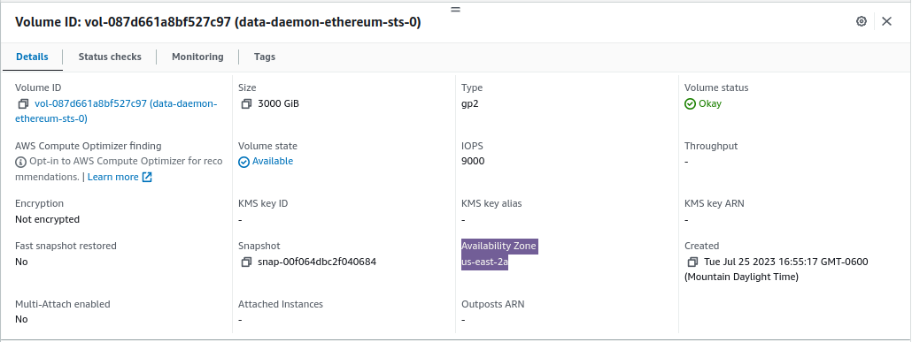
	- `PersistentVolumeClaim.metadata.name` follows the format of `data-{service}-{coinstack}-sts-{replicaNumber}`
	- `PersistentVolumeClaim.metadata.namespace` must match the namespace of the statefulset
	- `PersistentVolumeClaim.metadata.labels.asset` is the coinstack name
	- `PersistentVolumeClaim.spec.resources.requests.storage` must match the size of the EBS volume
	- `PersistentVolumeClaim.spec.volumeName` must match `PersistentVolume.metadata.name`
	- Example:  
	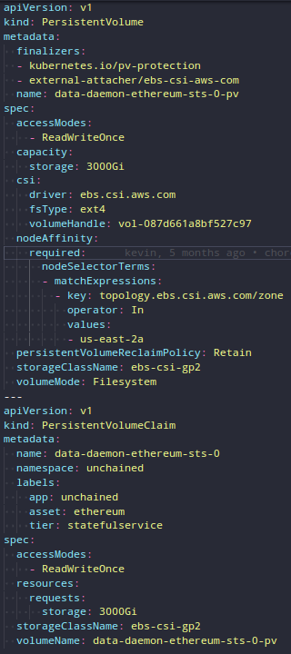
	- Write the file (don't check in changes after restore is complete)
1. Apply the yaml to create the new pvc and pv
	- Verify you are pointing at the correct kube context: `kubectl config current-context`
		- View all available contexts: `kubectl config get-contexts`
		- Set kube context: `kubectl config set-context {context_name}`
	- Apply the yaml: `kubectl apply -f path/to/restore-pvc.yaml`
	- Observe the pvc and pv are created in k9s
1. Manually scale the statefulset of the target coinstack back up in k9s (see above)
	- New ebs volumes take a bit of time to "warm" so initial start up after restore will be slow
	- Observe the statefulset is syncing and restored successfully

## Automated restore from snapshot

1. Make sure some `volumesnapshot` exists for a given coinstack
2. Scale down via Pulumi, either by CircleCI or by running `pulumi up`
3. Manually delete the existing PV and PVC
4. Scale up via Pulumi, either by CircleCI or by running `pulumi up`
