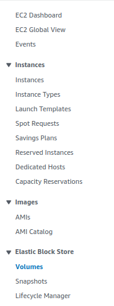

# Unchained coinstack backup & restore

Automated backup can be configured via nodestack config. Alternatively, manual snapshots can be taken either with the use of `VolumeSnapshot` k8s crd's, or via the EC2 Volume Snapshot mechanism.

## Manual Snapshot
1. Manually scale the statefulset of the target coinstack down in K9s.
	- Select desired namespace with: `:ns` (highlight namespace and press enter)  
	
	_if coinstacks are healthy in `unchained-dev` it is easiest to do it there to avoid any interruptions in production_  
	- Select desired statefulset with: `:sts` (highlight statefulset ex. `ethereum-sts`)  
	
	- Scale statefulset with: `s` (set replica count to one less than current count and select `OK`)  
	
	- This will trigger the statefulset to scale down which will make the ebs volume available for snapshot
2. Take a snapshot of the target coinstack's EBS volumes in the AWS console
	- Navigate to `EC2` -> `Elastic Block Store` -> `Volumes`  
	
	- Search by coinstack name (ex. `ethereum`) and wait for the `Volume state` to show `Available`  
	
	- EBS volumes created by kubernetes do not show a `Name`, but you can view the `Tags` to see what volume you are looking at (namespace and pvc name)  
	
	- Right click and select `Create snapshot`  
	
	- Enter the description in the form of `{coinstack}-{service}` and select `Create snapshot` (ex. `ethereum-indexer`, `ethereum-daemon`, `ethereum-daemon-beacon`)  
	
	- Repeat for each volume in the coinstack
3. Manually scale the statefulset back up to start the coinstack again  
	
3. Wait for snapshot to complete 
	- Navigate to `EC2` -> `Elastic Block Store` -> `Snapshots`
	- `Snapshot status` will go from `Pending` -> `Complete`
	

## Manual Restore
3. Delete the PVC and the PV of the coinstack
4. Update the `restore-pvc.yaml` with the coinstack details
5. Apply the yaml and scale STS back up

## Automated restore from snapshot

1. Make sure some `volumesnapshot` exists for a given coinstack
2. Scale down via Pulumi, either by CircleCI or by running `pulumi up`
3. Manually delete the existing PV and PVC
4. Scale up via Pulumi, either by CircleCI or by running `pulumi up`
